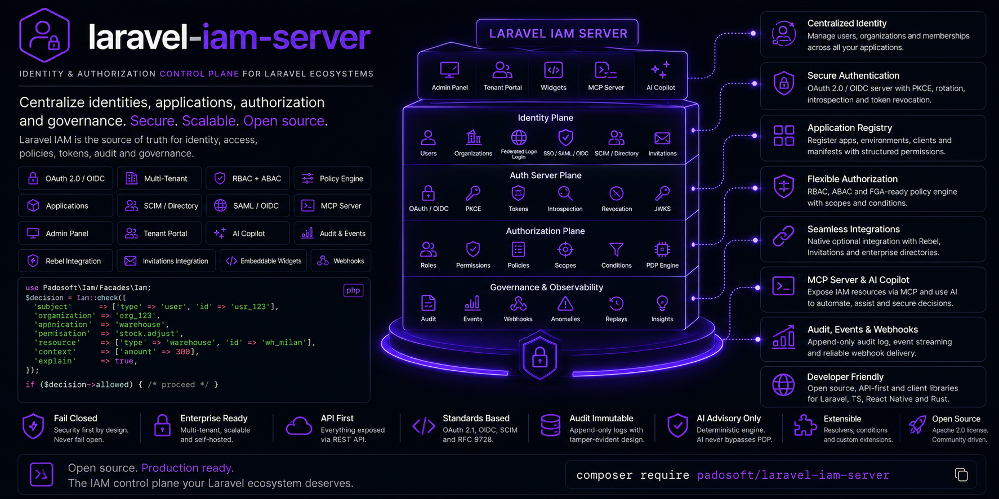

<p align="center">
  
</p>

<h1 align="center">Laravel IAM — Spatie Permission Bridge</h1>

<p align="center">
  <strong>Migrate from <code>spatie/laravel-permission</code> to Laravel IAM without a big-bang cutover.</strong><br>
  Scan your existing permissions, generate the IAM manifest, run both systems in <em>shadow</em>,
  diff every decision, and switch over only when the diff is clean — with a rollback always one env var away.
</p>

<p align="center">
  <a href="https://packagist.org/packages/padosoft/laravel-iam-bridge-spatie-permission"></a>
  <a href="https://packagist.org/packages/padosoft/laravel-iam-bridge-spatie-permission"></a>
  <a href="https://packagist.org/packages/padosoft/laravel-iam-bridge-spatie-permission"></a>
  <a href="LICENSE"></a>
</p>

---

## Why this package

`spatie/laravel-permission` is a great in-app RBAC library — until you outgrow it. Multiple apps, a real
audit trail, ABAC/ReBAC conditions, governance and access reviews, an OAuth/OIDC provider: that's a
**control plane**, and that's [Laravel IAM](https://github.com/padosoft/laravel-iam-server). But you can't
just flip authorization for a live application and hope. One wrong mapping and people are locked out of
production — or worse, let in.

This bridge makes the move **boring and reversible**. It treats migration as three observable phases:

1. **Inventory** — read your Spatie roles/permissions (read-only, touches nothing) and turn them into an
   IAM manifest.
2. **Shadow** — Spatie keeps deciding for real; IAM decides *in parallel* on every `Gate` check and
   **records only the mismatches**. Nobody is ever blocked or let in by IAM during this phase.
3. **Enforce** — once the mismatch log is clean (or every divergence is explained), flip `IAM_SPATIE_MODE`
   to `enforce`. IAM becomes the authority; Spatie stays as a read-only cache. Roll back by flipping the
   env var back.

You cut over on **evidence**, not hope.

## Features

- **`iam:spatie:scan`** — read-only inventory of `spatie/laravel-permission` straight from its tables
  (`SpatieScanner`). Emits `inventory.json` + a `report.md` that flags the smells: empty roles, orphan
  permissions, direct user grants, multiple guards.
- **`iam:spatie:manifest`** — generate a `laravel-iam.manifest.v2` from the inventory
  (`ManifestGenerator`), ready for `iam:manifest:validate` / `iam:app:register`.
- **`PermissionMapper`** — deterministic, idempotent slugging of Spatie names (`"orders.refund"`,
  `"Manage Users"`) to IAM keys (`^[a-z][a-z0-9_.-]*$`); two names that collapse to the same key surface a
  semantic duplicate to review. Includes a starting `risk` heuristic for high-impact actions.
- **`ShadowGate`** — a `Gate::after` adapter that compares IAM vs Spatie on every ability and returns
  `null`, so it **never changes the live outcome**. It probes Spatie directly (`hasPermissionTo`) instead of
  trusting a possibly short-circuited gate result — so you never cut over on false-zero mismatches.
- **`RecordsMismatch` / `MismatchRecorder`** — a pluggable sink for divergences (structured log by
  default; swap it to push to a dashboard or review queue).
- **Reversible cutover** — `shadow` ⇄ `enforce` is a single env var. Read-only write-protection keeps
  Spatie consistent after cutover.

## Use cases

- **Prove decision parity to stakeholders** before switching: run shadow in production traffic for a week,
  show a clean mismatch log, then cut over.
- **Migrate app-by-app** in a fleet: each application gets its own manifest and `IAM_SPATIE_APP` prefix.
- **De-risk a compliance-driven move**: keep the exact same enforcement behavior while you build confidence
  in the new control plane, with an instant rollback path.

## Installation

```bash
composer require padosoft/laravel-iam-bridge-spatie-permission
```

```bash
php artisan vendor:publish --tag=iam-spatie-config
```

**Requirements:** PHP **8.3+**, Laravel **13+**, an existing `spatie/laravel-permission` install, and a
reachable Laravel IAM server (via [`padosoft/laravel-iam-client`](https://github.com/padosoft/laravel-iam-client)).

## Quick start

The bridge ships in **shadow mode by default** (`IAM_SPATIE_MODE=shadow`) — installing it changes no
authorization behavior. Follow the runbook:

### 1. Inventory your current setup

```bash
php artisan iam:spatie:scan --output=storage/app/iam/spatie-inventory
# → inventory.json + report.md (roles, permissions, empty roles, direct grants, guards)
```

Open `report.md` and clean up the smells (inconsistent naming, semantic duplicates, critical permissions).

### 2. Generate the IAM manifest

```bash
php artisan iam:spatie:manifest --app=billing --name="Billing" \
  --output=storage/app/iam/iam.manifest.json
```

The manifest is a **proposal**: review the inferred `risk` levels and roles, then validate it on the server:

```bash
php artisan iam:manifest:validate storage/app/iam/iam.manifest.json
php artisan iam:app:register      storage/app/iam/iam.manifest.json
```

### 3. Observe in shadow

With `IAM_SPATIE_MODE=shadow`, the `ShadowGate` is registered automatically. Every `Gate` check is mirrored
to IAM and divergences are logged as `iam.shadow.mismatch`:

```php
// Your existing code — unchanged. Spatie still decides.
Gate::authorize('orders.refund', $order);
// In the background: IAM evaluates billing:orders.refund and logs only if it disagrees with Spatie.
```

Point the mismatch channel wherever your reviewers look:

```dotenv
IAM_SPATIE_APP=billing
IAM_SPATIE_MISMATCH_CHANNEL=iam-shadow
```

### 4. Review mismatches & cut over

When the mismatch log is clean (or every entry is explained), flip the mode:

```dotenv
IAM_SPATIE_MODE=enforce
```

IAM is now the authority (enforcement comes from the client's Gate adapter); Spatie becomes a read-only
cache. **Rollback** is the same switch in reverse: set `IAM_SPATIE_MODE=shadow` and you are back to Spatie
deciding, instantly.

## Ecosystem

| Package | Role |
| --- | --- |
| [laravel-iam-contracts](https://github.com/padosoft/laravel-iam-contracts) | Shared interfaces & DTOs — the dependency root |
| [laravel-iam-server](https://github.com/padosoft/laravel-iam-server) | The IAM server: identity, PDP (RBAC+ABAC+ReBAC), OAuth/OIDC, audit, governance, Admin API & panel |
| [laravel-iam-client](https://github.com/padosoft/laravel-iam-client) | Client for apps consuming Laravel IAM: OIDC login, JWT/JWKS, middleware, Gate adapter |
| **laravel-iam-bridge-spatie-permission** *(this repo)* | Zero-downtime migration off spatie/laravel-permission |
| [laravel-iam-ai](https://github.com/padosoft/laravel-iam-ai) | Optional AI module: advisory-only governance (redaction + hallucination guard + audit) |
| [laravel-iam-directory](https://github.com/padosoft/laravel-iam-directory) | Optional directory module: LDAP / Active Directory (LdapRecord); SCIM in v2 |

## Documentation

A docmd doc-site lives in [`docs/`](docs/): start at [`docs/index.md`](docs/index.md), then
[Getting started](docs/getting-started.md), [Concepts](docs/concepts.md), the step-by-step
[Migration runbook](docs/migration-runbook.md), and the [Reference](docs/reference.md).

## Security

Migration is **fail-closed and non-destructive**: the scanner is read-only, shadow mode never alters a live
decision, and decision diffing uses **deny-overrides** — when in doubt, deny. Permission and role slugs are
**immutable** (`app_key:permission`). If you discover a security issue, email **security@padosoft.com**
rather than opening a public issue.

## License

MIT © [Padosoft](https://www.padosoft.com). See [LICENSE](LICENSE).
