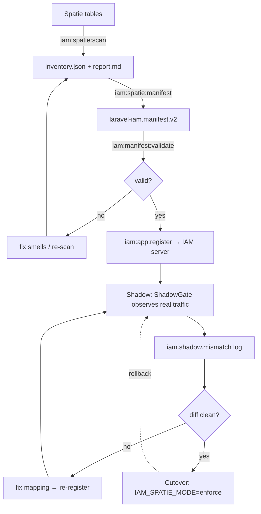

# Migration pipeline

The bridge defines a single linear pipeline with one feedback loop. Every stage produces a concrete
**artifact**, and the transition between observation and enforcement is **gated** on evidence.

## The pipeline



## Stages and artifacts

| Stage | Command / trigger | Artifact | Owned by |
|---|---|---|---|
| **Inventory** | `iam:spatie:scan` | `inventory.json`, `report.md` | this bridge (`SpatieScanner`) |
| **Manifest** | `iam:spatie:manifest` | `laravel-iam.manifest.v2` (JSON) | this bridge (`ManifestGenerator`) |
| **Validate** | `iam:manifest:validate` | pass/fail | `laravel-iam-server` |
| **Register** | `iam:app:register` | application registered on server | `laravel-iam-server` |
| **Shadow** | `IAM_SPATIE_MODE=shadow` (default) | `iam.shadow.mismatch` stream | this bridge (`ShadowGate`) |
| **Review** | human + log aggregation | a clean (or annotated) diff | you |
| **Cutover** | `IAM_SPATIE_MODE=enforce` | IAM as authority | `laravel-iam-client` (enforcement) |
| **Rollback** | `IAM_SPATIE_MODE=shadow` | back to Spatie | this bridge |

## The two gates

The pipeline has exactly two places where it refuses to advance:

::: steps
1. **Validation gate (`iam:manifest:validate`).**
   A manifest that does not satisfy the `laravel-iam.manifest.v2` schema is rejected before it can be
   registered. This catches structural errors (invalid keys, missing fields) mechanically.

2. **Evidence gate (clean diff).**
   The transition from shadow to enforce is gated on the `iam.shadow.mismatch` log being clean over
   representative traffic. This catches *semantic* errors (a role mapped to the wrong permissions) that a
   schema cannot see. See [shadow before cutover](/concepts/shadow-before-cutover).
:::

## Idempotency and re-runs

Every stage before cutover is **safe to repeat**:

- `iam:spatie:scan` is read-only and reflects the live tables — re-run after any cleanup.
- `iam:spatie:manifest` is a pure function of the current scan — re-run to regenerate.
- `PermissionMapper` is deterministic and idempotent, so re-running yields the **same** keys — manifests do
  not churn and the shadow comparison stays stable across re-registrations.

This is what lets the feedback loop (`review → fix → re-register → re-observe`) converge instead of chasing a
moving target.

## Worked example: one full pass

```bash
# 1. inventory
php artisan iam:spatie:scan --output=storage/app/iam/billing-inv
# 2. manifest (proposal)
php artisan iam:spatie:manifest --app=billing --name="Billing" \
  --output=storage/app/iam/billing.manifest.json
# 3. validate + register (server)
php artisan iam:manifest:validate storage/app/iam/billing.manifest.json
php artisan iam:app:register      storage/app/iam/billing.manifest.json
# 4. observe (env)
#    IAM_SPATIE_MODE=shadow ; IAM_SPATIE_APP=billing ; IAM_SPATIE_MISMATCH_CHANNEL=iam-shadow
# 5. review iam.shadow.mismatch until clean, fixing the manifest and re-registering as needed
# 6. cut over (env)
#    IAM_SPATIE_MODE=enforce
```

::: collapsible "ADR — one linear pipeline with explicit gates"
**Problem.** Migrations that lack a defined sequence and explicit go/no-go gates drift: people register
unreviewed manifests, or cut over without evidence.

**Decision.** Define a single linear pipeline with two hard gates — schema validation before register, and a
clean diff before enforce — and make every pre-cutover stage idempotent so the review loop converges.

**Consequences.** The path is predictable and auditable; the gates are where humans and tooling make explicit
decisions. The cost is that the bridge depends on the server's validate/register commands for the gate it
does not own.
:::

::: callout warning "Gotchas"
- Re-run `iam:spatie:scan` **after** cleaning smells; the manifest is only as good as the scan it was built
  from.
- Validation (`iam:manifest:validate`) and registration (`iam:app:register`) are **server** commands, not
  shipped by this bridge — they require `laravel-iam-server`.
- The rollback edge re-enters at **Shadow**, not at the start; you never re-scan to roll back.
:::

## Next

- [Manifest contract](/architecture/manifest-contract) — the schema the pipeline produces.
- [ShadowGate internals](/architecture/shadow-gate) — the observation stage in detail.
