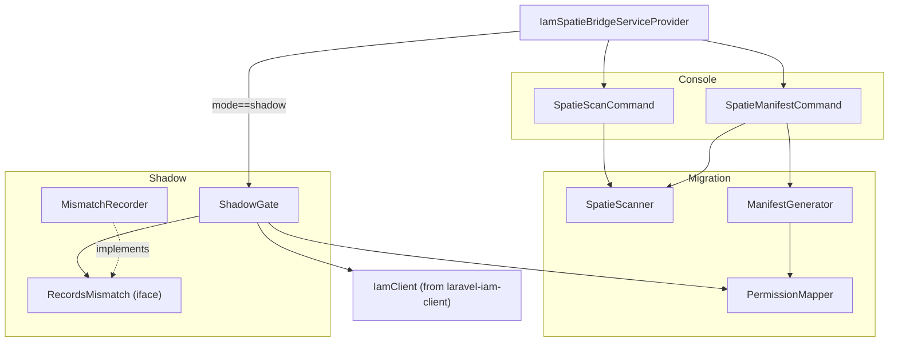
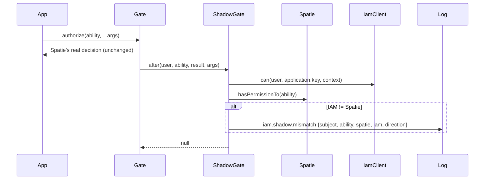

# Architecture overview

Everything lives under the `Padosoft\Iam\Bridge\Spatie\` namespace in `src/`, organized into three small
domains plus the service provider. This page is the map; each part has its own deep page.

## The `src/` tree

```text
src/
  Console/
    SpatieScanCommand.php        # iam:spatie:scan      — read-only inventory → inventory.json + report.md
    SpatieManifestCommand.php    # iam:spatie:manifest  — inventory → laravel-iam.manifest.v2
  Migration/
    SpatieScanner.php            # reads the Spatie tables (SELECT only): roles/permissions/direct/guards
    PermissionMapper.php         # deterministic slug Spatie name → IAM key + risk heuristic
    ManifestGenerator.php        # inventory → manifest v2 (dedup keys, starting risk)
  Shadow/
    ShadowGate.php               # Gate::after: compares IAM vs Spatie, returns null (no change)
    RecordsMismatch.php          # interface: the mismatch sink (pluggable)
    MismatchRecorder.php         # default sink → structured log `iam.shadow.mismatch`
  IamSpatieBridgeServiceProvider.php  # registers commands, bindings; in mode=shadow hooks ShadowGate
config/iam-spatie.php            # mode (shadow|enforce), application prefix, cache, mismatch_log_channel
```

## The domains



## Subsystem map

| Namespace | Responsibility | Deep page |
|---|---|---|
| `Console/` | The two artisan commands that drive scan and manifest generation | [CLI reference](/reference/cli) |
| `Migration/SpatieScanner` | Read-only inventory of the Spatie tables (names from `permission.table_names`) | [Inventory & scan](/guides/inventory-and-scan) |
| `Migration/PermissionMapper` | Deterministic/idempotent slugging + risk heuristic | [Permission slugging](/concepts/permission-slugging) |
| `Migration/ManifestGenerator` | Inventory → `laravel-iam.manifest.v2`, dedup + starting risk | [Manifest contract](/architecture/manifest-contract) |
| `Shadow/ShadowGate` | `Gate::after` comparison, returns `null` | [ShadowGate internals](/architecture/shadow-gate) |
| `Shadow/RecordsMismatch` + `MismatchRecorder` | Pluggable mismatch sink (default: structured log) | [Observability](/operations/observability) |
| `IamSpatieBridgeServiceProvider` | Wiring: commands, singletons, conditional `ShadowGate` hook | this page |

## Dependencies

The bridge sits **on top of** the rest of the ecosystem rather than reimplementing it:

| Dependency | Used for |
|---|---|
| [`padosoft/laravel-iam-client`](https://doc.laravel-iam-client.padosoft.com) | `IamClient::can()` (the parallel IAM decision) and `resolveSubjectId()` |
| [`padosoft/laravel-iam-server`](https://doc.laravel-iam-server.padosoft.com) | the `iam:manifest:validate` / `iam:app:register` commands and the PDP that decides |
| [`padosoft/laravel-iam-contracts`](https://doc.laravel-iam-contracts.padosoft.com) | shared DTOs/contracts |
| `spatie/laravel-permission` | the source system being migrated (tables + `hasPermissionTo`) |
| `spatie/laravel-package-tools` | the `PackageServiceProvider` base (config + command registration) |

## A check, end to end (shadow)



## Next

- [Migration pipeline](/architecture/migration-pipeline) — the data flow scan → manifest → shadow → cutover.
- [ShadowGate internals](/architecture/shadow-gate) — the runtime class in detail.
- [ADR](/architecture/decisions) — the reasoning behind the design, as decision records.
