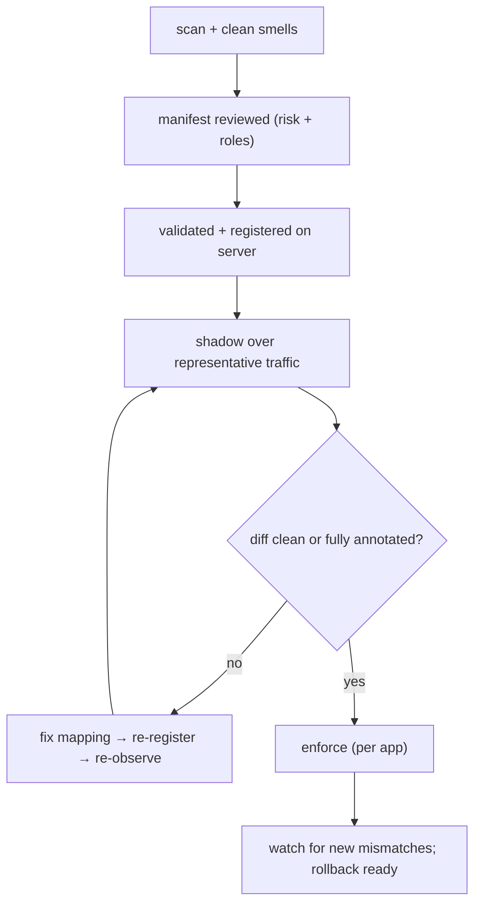

# Safe migration

The package makes a safe migration *possible*; these practices make it *likely*. They distill the
[shadow-before-cutover](/concepts/shadow-before-cutover) strategy into operational rules.

## Do

::: callout success "The short list"
- **Start in shadow and stay there until the diff is clean.** It is the default — do not rush past it.
- **Run a representative window.** Cover month-end jobs, admin flows, and rare roles, not just a quiet day.
- **Treat `spatie_deny_iam_allow` as the severe direction.** It is a potential privilege escalation; verify
  every one.
- **Cut over per application.** One manifest and one `IAM_SPATIE_APP` per app; prove parity independently.
- **Keep Spatie installed and the cache synced** so rollback stays one env var away.
- **Re-scan after cleanup.** The manifest is only as good as the scan it came from.
:::

## Don't

::: callout danger "Anti-patterns"
- **Don't cut over with unexplained mismatches.** Every divergence is a mapping bug to fix or an intended
  change to document — never "noise".
- **Don't trust the `Gate::after` result as Spatie's answer.** The bridge already probes Spatie directly;
  don't reintroduce the false-zero by short-circuiting checks elsewhere during shadow.
- **Don't treat the manifest's `risk` as truth.** Re-rate critical permissions by hand.
- **Don't shorten the shadow window to hit a date.** The diff's value is entirely in its representativeness.
- **Don't migrate the whole fleet at once.** A clean diff for `billing` says nothing about `crm`.
:::

## A defensible cutover checklist

::: steps
1. **Inventory reviewed.** `report.md` smells addressed (empty roles, direct grants, duplicates, guards).
2. **Manifest reviewed.** Risk levels re-rated where the heuristic is wrong; roles composed correctly.
3. **Registered.** `iam:manifest:validate` passes, `iam:app:register` applied.
4. **Shadow evidence.** A clean `iam.shadow.mismatch` log over a representative window — saved as the
   audit artifact.
5. **Cutover.** `IAM_SPATIE_MODE=enforce` for that app; config cache cleared.
6. **Post-cutover watch.** Keep watching the log; if mismatches reappear, roll back to `shadow` and
   investigate.
:::

## Keep the rollback warm

Rollback is only instant if the conditions for it persist:

- Spatie stays installed and its tables remain a valid (read-only) cache (`cache.write_protection`,
  `cache.sync_on_webhook`, `cache.sync_on_login`).
- No application code starts writing to Spatie tables as if they were authoritative.
- The shadow evidence is archived, so a regression can be compared against the known-good baseline.

::: callout warning "After cutover, mismatches still matter"
A clean diff at cutover does not mean the systems will agree forever — IAM policy or Spatie data can change.
Keep the mismatch channel alive (or periodically re-enter shadow) so a regression is visible before it
becomes an incident.
:::

## Next

- [Naming & mapping hygiene](/best-practices/naming-and-mapping) — get the keys right at the source.
- [Reviewing mismatches](/guides/reviewing-mismatches) — the review loop in detail.
