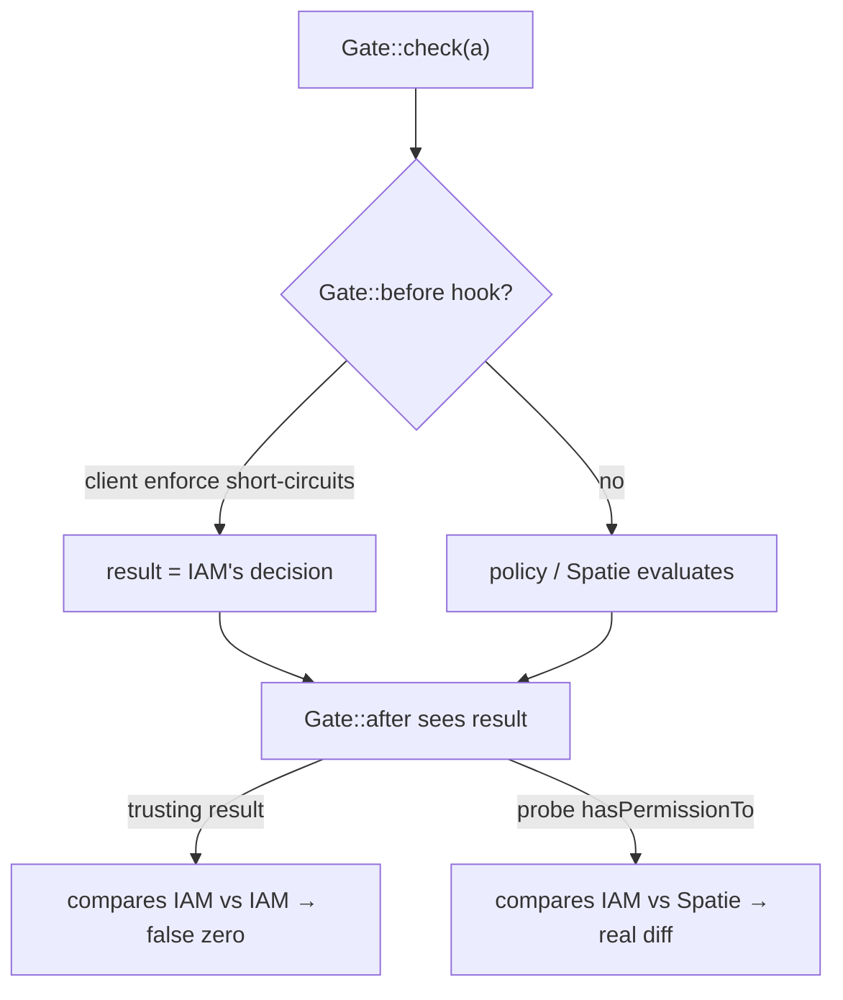

# Decision diffing & deny-overrides

Shadow mode reduces to one comparison, repeated on every `Gate` check: **does IAM agree with Spatie?** This
page makes that comparison precise.

## Motivation

The whole value of shadow mode is the trustworthiness of its diff. If the comparison is subtly wrong — if it
compares IAM against the wrong "Spatie answer" — a clean log is worthless and you cut over on invalid data.
The bridge therefore takes deliberate care about *what* it compares.

## The comparison, formally

For a subject $u$ and an ability $a$, let

$$
S(u, a) \in \{0, 1\} \quad\text{(Spatie's decision)} \qquad I(u, a) \in \{0, 1\} \quad\text{(IAM's decision)}
$$

A mismatch is recorded iff the two disagree:

$$
\text{mismatch}(u, a) \iff S(u, a) \neq I(u, a)
$$

In code (`ShadowGate::compare`):

```php
$iamAllows = $this->client->can($user, $iamAbility, $context);
$spatieAllows = $this->spatieAllows($user, $ability, $localResult);

if ($iamAllows !== $spatieAllows) {
    $this->recorder->record($this->client->resolveSubjectId($user), $ability, $spatieAllows, $iamAllows);
}
```

## Why probe Spatie directly

The naive implementation would take $S(u,a)$ from the `?bool $result` that `Gate::after` hands you. That is a
trap.



If another `Gate::before` (for example the IAM client's own enforcement in a partially-migrated app)
short-circuits the gate, the `$result` *is already IAM's decision*. Comparing IAM against it yields
$I(u,a) = S(u,a)$ trivially — a **false-zero mismatch**: a perfectly clean diff computed on invalid data. You
would cut over believing the systems agree when you never actually measured Spatie.

The bridge avoids this by computing $S(u,a)$ from a **direct probe** of Spatie:

```php
$probe = [$user, 'hasPermissionTo'];
if (is_callable($probe)) {
    try {
        return (bool) $probe($ability);
    } catch (\Throwable) {
        return false; // unknown to Spatie → deny
    }
}
return $gateResult === true; // no Spatie trait → last-resort fallback
```

::: callout danger "Never trust the Gate::after result as 'Spatie's answer'"
This is the single most important correctness property of the bridge. The comparison must measure the
**source** system (Spatie) independently, or the diff is meaningless.
:::

## Deny-overrides

When Spatie's answer cannot be determined cleanly, the bridge is **fail-closed**: it resolves toward
**deny**. If `hasPermissionTo` throws — the permission is unknown to Spatie — the probe returns `false`:

$$
S(u, a) = 0 \quad\text{whenever Spatie cannot affirm the grant.}
$$

This deny-overrides bias means a permission Spatie has never heard of can never read as an accidental allow,
so it cannot manufacture a "they agree on allow" that hides a real divergence.

## Mismatch direction

Every recorded divergence carries a `direction`, derived purely from Spatie's side:

```php
'direction' => $spatieAllows ? 'spatie_allow_iam_deny' : 'spatie_deny_iam_allow',
```

| `spatie_allows` | `iam_allows` | direction | cutover risk |
|---|---|---|---|
| `true` | `false` | `spatie_allow_iam_deny` | user **loses** access → lockout |
| `false` | `true` | `spatie_deny_iam_allow` | user **gains** access → escalation |

The escalation direction (`spatie_deny_iam_allow`) is the higher-severity one — see
[reviewing mismatches](/guides/reviewing-mismatches).

::: collapsible "ADR — direct probe + deny-overrides over a convenient gate result"
**Problem.** Reusing the `Gate::after` `$result` is convenient but can compare IAM with IAM (false zero).
Treating an unknown permission as "allow by default" would hide divergences.

**Decision.** Compute Spatie's decision from a direct `hasPermissionTo` probe, independent of the gate
result, and bias unknowns to **deny** (fail-closed). Record a mismatch strictly on `$iamAllows !== $spatieAllows`.

**Consequences.** The diff faithfully measures the two systems and never invents agreement. The cost is a
dependency on the Spatie trait being present on the user model; without it the bridge falls back to the gate
result and logs less reliably — which is why the trait is a documented requirement.
:::

::: callout warning "Gotchas"
- The probe requires `hasPermissionTo` to be callable on the user model (Spatie's traits). Keep it installed
  on the migrated model.
- Deny-overrides means a *missing* permission shows as deny on both sides → **no** mismatch. That is correct,
  but it means "no mismatch" is not the same as "permission exists in IAM" — validate the manifest
  separately.
- `IamClient::can()` is a network call; a transport error is the client's concern, not the diff's — see the
  client docs for its fail-closed behavior.
:::

## Next

- [Shadow mode](/guides/shadow-mode) — the runtime that performs this comparison.
- [Shadow before cutover](/concepts/shadow-before-cutover) — why you measure before you switch.
