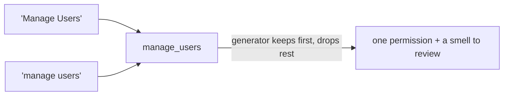

# Permission slugging

`PermissionMapper` is the function that turns free-form Spatie names (`"orders.refund"`, `"Manage Users"`,
`"2FA reset"`) into **valid IAM keys**. It is small, but it is load-bearing: every manifest key and every
shadow comparison flows through it.

## Motivation

Spatie permission names are arbitrary strings. IAM keys are constrained: they must match the slug grammar
`^[a-z][a-z0-9_.-]*$` enforced by the server's manifest validator. The mapper bridges the two — and it must
do so **deterministically** (same input → same output, every time) and **idempotently** (slugging an
already-valid key is a no-op), or the same permission would map to different keys across runs and break the
shadow comparison.

## The slug grammar

A valid IAM key is the language

$$
L = \{\, s \mid s \in [a\text{-}z]\,[a\text{-}z0\text{-}9\_.\text{-}]^{*} \,\}
$$

— it starts with a lowercase letter, then any of lowercase letters, digits, `_`, `.`, `-`.

## The algorithm

`PermissionMapper::toKey()` applies these steps:

```php
$key = strtolower(trim($name));                      // 1. lowercase + trim
$key = preg_replace('/[^a-z0-9_.-]+/', '_', $key);   // 2. illegal runs → single "_"
$key = preg_replace('/_{2,}/', '_', $key);           // 3. collapse repeated "_"
$key = trim($key, '_.-');                            // 4. trim separators from ends
if ($key === '') return 'perm';                      // 5. empty → "perm"
if (preg_match('/^[a-z]/', $key) !== 1)              // 6. must start with [a-z]
    $key = 'p_'.$key;                                //    else prefix "p_"
```

| Input | Output |
|---|---|
| `orders.refund` | `orders.refund` |
| `Manage Users` | `manage_users` |
| `  Orders   Refund  ` | `orders_refund` |
| `2fa.reset` | `p_2fa.reset` |
| `***` | `perm` |
| `users--export` | `users--export` |

Properties:

- **Deterministic** — pure function of the input string.
- **Idempotent** — `toKey(toKey(x)) == toKey(x)`; a name already in $L$ passes through unchanged.
- **Total** — every input yields a valid key (the `perm` / `p_` fallbacks guarantee membership in $L$).

## Collisions are semantic duplicates

Slugging is **not injective**: distinct names can map to the same key.

$$
\text{toKey}(\text{"Orders Refund"}) = \text{toKey}(\text{"orders.refund"}) = \texttt{?}
$$

Not exactly — `"Orders Refund"` → `orders_refund` while `"orders.refund"` → `orders.refund`, so those two
differ. But `"Manage Users"` and `"manage   users"` both collapse to `manage_users`. When that happens, the
[`ManifestGenerator`](/guides/manifest-generation) keeps the **first** occurrence and drops the rest — and a
collision is exactly the **semantic duplicate** smell you should review by hand. Two names that mean
different things must not share a key.



## full_key resolution

`toFullKey()` produces the IAM `full_key` used for grants and shadow comparison:

```php
public function toFullKey(string $application, string $name): string
{
    return str_contains($name, ':') ? $name : $application.':'.$this->toKey($name);
}
```

A name that already contains `:` is treated as fully-qualified and passes through; otherwise it is namespaced
under the application: `billing` + `orders.refund` → `billing:orders.refund`. `ShadowGate` uses the same rule
when it builds the ability to ask IAM.

## The risk heuristic

`inferRisk()` gives each permission a starting risk for the manifest. It inspects the **last `.`-segment** (the
action) and returns `high` if it is in a fixed high-impact set, else `low`:

```php
private const HIGH_RISK = ['refund', 'delete', 'destroy', 'drop', 'truncate', 'grant',
    'revoke', 'impersonate', 'export', 'approve', 'disable', 'suspend', 'wipe'];
```

| Key | Action segment | Risk |
|---|---|---|
| `orders.refund` | `refund` | `high` |
| `users.export` | `export` | `high` |
| `posts.view` | `view` | `low` |
| `manage_users` | `manage_users` | `low` |

::: collapsible "ADR — deterministic, idempotent, total slugging"
**Problem.** If the same permission slugged to different keys across runs, the manifest would churn and the
shadow comparison would compare a permission against a different key than the one registered — producing
phantom mismatches.

**Decision.** Make `toKey` a pure, idempotent, **total** function: deterministic output, no-op on valid
input, and a guaranteed-valid result for every input (empty → `perm`, non-letter start → `p_…`). Surface
non-injectivity (collisions) as a reviewable smell rather than hiding it.

**Consequences.** Keys are stable across runs and re-registrations. The cost is that two genuinely different
names can collide; the generator's "keep first" rule plus the inventory report make that visible so a human
resolves it.
:::

::: callout warning "Gotchas"
- **Slugging is lossy.** `"Orders/Refund"`, `"orders refund"` and `"orders-refund"` can converge. Review the
  inventory `report.md` for collisions before trusting the manifest.
- **Risk only reads the last `.`-segment.** A high-impact custom action the set doesn't list stays `low` —
  re-rate it by hand.
- **Names with `:` are passed through** as already-qualified `full_key`s — make sure that is intended.
:::

## Next

- [Manifest generation](/guides/manifest-generation) — where slugging is applied and deduped.
- [Decision diffing & deny-overrides](/concepts/decision-diffing) — how the slugged key is compared at runtime.
