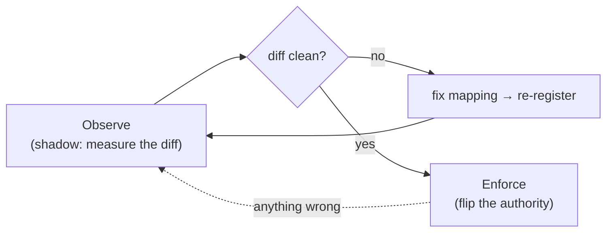

# Shadow before cutover

"Shadow before cutover" is not a feature; it is the **strategy** the whole package encodes. Every class
exists to make that ordering possible and safe. This page argues for it.

## Motivation

Authorization is the one subsystem you cannot get wrong silently. A wrong decision either **locks out** a
legitimate user (an outage you will hear about) or **lets in** an illegitimate one (a breach you might not).
Both failure modes are unacceptable in production, and both are exactly what a blind authorization switch
risks.

## The risk model of a blind switch

Suppose you migrate $n$ permission checks and your mapping has an unknown error rate $p$ per check. The
probability that a big-bang cutover is **completely** clean is

$$
P(\text{no error}) = (1 - p)^{n}
$$

For even a small per-mapping error rate over a realistic estate this collapses toward zero:

| $n$ | $p = 0.5\%$ | $p = 2\%$ |
|---|---|---|
| 50 | $0.78$ | $0.36$ |
| 200 | $0.37$ | $0.018$ |
| 1000 | $0.007$ | $\approx 0$ |

A blind switch is a bet that *every* mapping is right at once. Shadow mode changes the game: instead of
betting, you **measure** $p$ on real traffic and drive it to zero before you switch.

## The ordering

Observation **must** precede enforcement because:

1. **You cannot measure parity after you switch** — once IAM enforces, Spatie is no longer answering real
   checks, so there is nothing to compare against.
2. **The cost of a wrong decision is asymmetric and high** — measuring is cheap (a log line); a production
   lockout or escalation is not.
3. **A reversible switch is only valuable if you know when to use it** — the clean diff is the signal that
   says "safe to go", and the same evidence tells you a regression has appeared if mismatches return.

## What a clean diff actually buys you

A clean `iam.shadow.mismatch` log over representative traffic is a **proof of behavioral equivalence on the
paths that occurred**:

$$
\forall (u, a) \in T:\quad S(u, a) = I(u, a)
$$

where $T$ is the set of checks observed in the shadow window. It is empirical, not exhaustive — which is why
the window must be representative (month-end, admin flows, rare roles). But it is *evidence from your own
system*, which is far stronger than a passing test suite written against assumptions.

::: callout tip "Cut over on evidence, not hope"
The clean diff is the artifact you show stakeholders. "We ran both systems on production traffic for a week
and they agreed on every decision" is a sentence you can defend. "We mapped it carefully and it should be
fine" is not.
:::

## How the package enforces the ordering

- **Default is `shadow`.** Installing the bridge cannot accidentally enforce anything.
- **Shadow returns `null` from `Gate::after`.** Observation is structurally incapable of changing an outcome.
- **Enforce only *stops* observing.** The bridge never flips the authority itself — the client's Gate adapter
  does — so "enforce" is a deliberate, separate decision.
- **Rollback is the same flag.** The escape hatch is always one env var away, so attempting the forward move
  is safe.

::: collapsible "ADR — observe-then-enforce as the package's reason to exist"
**Problem.** Teams either avoid migrating off Spatie (fear of breakage) or migrate big-bang (and get burned).
Both come from the absence of a safe transition.

**Decision.** Encode "shadow before cutover" as the package's core strategy: read-only scan → manifest →
shadow observation that changes nothing → evidence-gated, reversible cutover. Make shadow the default and
enforcement the client's job, so the bridge's only responsibility is the safe transition.

**Consequences.** Migration becomes a measured, defensible, reversible process. The trade-off is operational
patience and running both systems in parallel for a while — a small price for not getting authorization
wrong in production.
:::

::: callout warning "Gotchas"
- A clean diff covers only **observed** checks. Unexercised paths (a quarterly admin job) are not proven —
  size the shadow window accordingly.
- "Shadow before cutover" is per application. Proving parity for `billing` says nothing about `crm`.
- Do not shorten the shadow window to hit a deadline; the diff's value is entirely in its representativeness.
:::

## Next

- [Reviewing mismatches](/guides/reviewing-mismatches) — driving the diff to clean.
- [Cutover & rollback](/guides/cutover-and-rollback) — the reversible switch the strategy enables.
