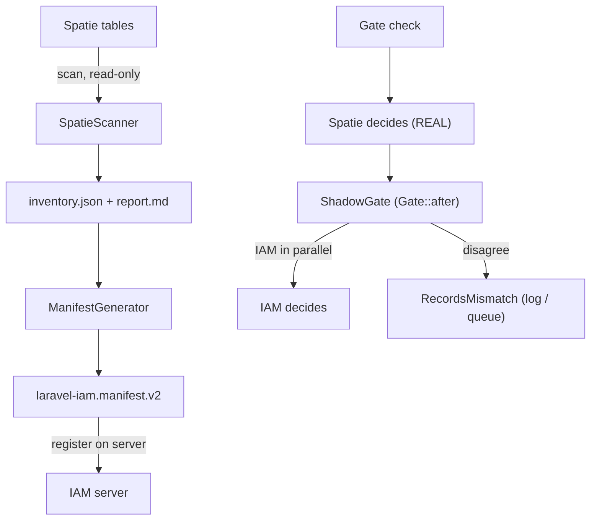

# Core concepts

## The problem

`spatie/laravel-permission` stores roles and permissions in your app's database and answers `Gate`/`can()`
checks **locally**. Moving authorization to an external control plane (Laravel IAM) means a *different*
system starts answering those checks. Flip it blindly on a live app and a single bad mapping either locks
people out or — worse — lets them in. You need a way to **prove the two systems agree** before you trust the
new one.

## Mental model

Migration is an **observation problem before it is a switch**. Run both authorities side by side, watch where
they disagree, fix the mappings, and only then change who decides.



## Core entities

| Entity | Responsibility |
|---|---|
| **`SpatieScanner`** | Read-only inventory of the Spatie tables: roles, permissions, role↔permission, direct user grants, guards. |
| **`PermissionMapper`** | Deterministic, idempotent slugging of Spatie names → IAM keys (`^[a-z][a-z0-9_.-]*$`), plus a `risk` heuristic for high-impact actions. |
| **`ManifestGenerator`** | Turns the inventory into a `laravel-iam.manifest.v2`, deduping keys that collide (semantic duplicates to review). |
| **`ShadowGate`** | A `Gate::after` hook that compares IAM vs Spatie and returns `null` — never alters the live result. |
| **`RecordsMismatch` / `MismatchRecorder`** | The pluggable sink for divergences (structured log by default). |

These map one-to-one to the three deeper concept pages:
[permission slugging](/concepts/permission-slugging),
[decision diffing & deny-overrides](/concepts/decision-diffing), and
[shadow before cutover](/concepts/shadow-before-cutover).

## The shadow example

In shadow your code is unchanged:

```php
Gate::authorize('orders.refund', $order);  // Spatie decides, as always
```

Behind the scenes `ShadowGate` evaluates `billing:orders.refund` on IAM and, **only if it disagrees** with
Spatie, emits:

```text
iam.shadow.mismatch  { subject_id, ability, spatie_allows, iam_allows, direction }
```

## Three invariants that make it safe

::: callout danger "Shadow never alters the live outcome"
`ShadowGate` uses `Gate::after` and returns `null`: it observes and records, it never blocks or grants. No
user is impacted until you switch to `enforce`.
:::

::: callout warning "Diffing is deny-overrides"
When in doubt, record the mismatch on the **deny** side. A permission unknown to Spatie resolves to deny — so
you cannot cut over on a false "everything agrees".
:::

::: callout info "Probe Spatie directly, not the Gate::after result"
The `?bool $result` passed to `Gate::after` may have been short-circuited by another `Gate::before` (e.g. the
IAM client's own enforcement). Comparing against it would compare **IAM with IAM** and produce a false-zero
diff. The bridge probes Spatie directly via `hasPermissionTo` instead.
:::

## Why this design

Authorization is the one thing you cannot get wrong silently. A read-only scanner, a shadow phase that
changes nothing, deny-overrides diffing, and an env-var cutover make the migration **observable and
reversible** — you can always go back to the system that was working a second ago.

## Next

- [Permission slugging](/concepts/permission-slugging) — how names become stable IAM keys.
- [Decision diffing & deny-overrides](/concepts/decision-diffing) — the comparison semantics.
- [Shadow before cutover](/concepts/shadow-before-cutover) — why the order matters.
