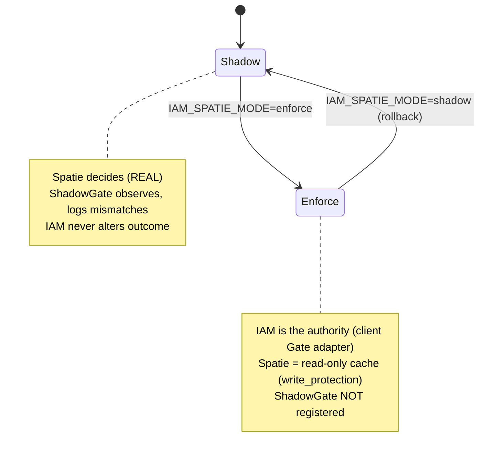

# Cutover & rollback

Cutover is a **single environment variable**. When the [mismatch log](/guides/reviewing-mismatches) is clean,
you flip `IAM_SPATIE_MODE` from `shadow` to `enforce`. Rollback is the same switch in reverse — instant, with
no data migration to undo.

## Motivation

The most dangerous moment in an authorization migration is the switch. Anything that requires a deploy, a
data migration, or a code change to revert is a switch you cannot safely make on a live system. The bridge
makes the switch a config value precisely so that going back is as cheap as going forward.

## What changes at cutover



| | Shadow (`mode=shadow`) | Enforce (`mode=enforce`) |
|---|---|---|
| Who decides | **Spatie** (real) | **IAM** (via the client's Gate adapter) |
| `ShadowGate` | registered on `Gate::after`, logs mismatches | **not** registered |
| Spatie tables | source of truth | read-only cache (`cache.write_protection`) |
| User impact | none | IAM decisions are now enforced |
| Revert | n/a | flip back to `shadow` |

::: callout info "Enforcement lives in the client, not the bridge"
The bridge does not implement enforcement. In `enforce` mode it simply **stops** registering the
`ShadowGate`; authorization is enforced by the IAM client's Gate adapter
([`padosoft/laravel-iam-client`](https://doc.laravel-iam-client.padosoft.com)). The bridge's job is the safe,
observable *transition* — not the steady state.
:::

## Cut over

Once the diff is clean:

```dotenv
IAM_SPATIE_MODE=enforce
```

Deploy the env change (and clear config cache if you cache config: `php artisan config:clear`). From this
point IAM is the authority and Spatie is a read-only cache kept in sync.

## Spatie as a read-only cache

After cutover, the `cache` config keeps the local Spatie data consistent without letting it drift:

```php
'cache' => [
    'write_protection' => true,  // block/audit local writes to Spatie tables
    'sync_on_webhook' => true,   // re-sync the local cache on IAM webhooks
    'sync_on_login' => true,     // re-sync the local cache on login
],
```

`write_protection` ensures nobody mutates the now-secondary Spatie tables behind IAM's back; the `sync_*`
flags keep the cache fresh from the authoritative IAM server.

## Rollback (anytime)

```dotenv
IAM_SPATIE_MODE=shadow
```

That is the entire rollback. The `ShadowGate` re-registers, Spatie decides again exactly as before, and IAM
returns to parallel observation. Because shadow never altered any data, there is nothing to reconcile.

## Fleet migration: app by app

In a multi-app estate, migrate **one application at a time**. Each app gets its own manifest and its own
`IAM_SPATIE_APP` prefix, so you can prove parity and cut over independently:

::: steps
1. **Per-app manifest.**
   ```bash
   php artisan iam:spatie:manifest --app=billing --name="Billing" \
     --output=storage/app/iam/billing.manifest.json
   ```

2. **Per-app shadow.**
   Set `IAM_SPATIE_APP=billing` in that app's environment and observe its traffic only.

3. **Per-app cutover.**
   Flip `IAM_SPATIE_MODE=enforce` for that app once its diff is clean. Other apps stay in shadow,
   unaffected.
:::

::: collapsible "ADR — cutover as a single reversible env var"
**Problem.** A cutover that requires code or schema changes to revert is not safely reversible on a live
system; teams hesitate to cut over, or cannot back out fast when something is wrong.

**Decision.** Model the cutover as one flag, `IAM_SPATIE_MODE` (`shadow ⇄ enforce`). Shadow changes no data;
enforce only stops registering the observer and lets the client enforce. Rollback is the same flag flipped
back.

**Consequences.** Going back is as cheap as going forward, which makes the forward move safe to attempt.
The trade-off is that both systems must remain installed and the Spatie cache kept consistent
(`write_protection` + `sync_*`) for as long as you want the rollback option.
:::

::: callout warning "Gotchas"
- **Clear config cache** after changing the env var if you run `config:cache` — otherwise the old mode
  persists.
- **Keep Spatie installed** through and after cutover. It remains the rollback target and the read-only
  cache.
- **Don't write to Spatie tables in `enforce`** outside the sync path; `write_protection` is there to catch
  it, but application code should treat them as read-only.
- **Cut over per app, not globally**, unless you genuinely run a single application.
:::

## Next

- [Shadow before cutover](/concepts/shadow-before-cutover) — why this ordering is non-negotiable.
- [Configuration](/operations/configuration) — `mode`, `application`, and the `cache` block.
