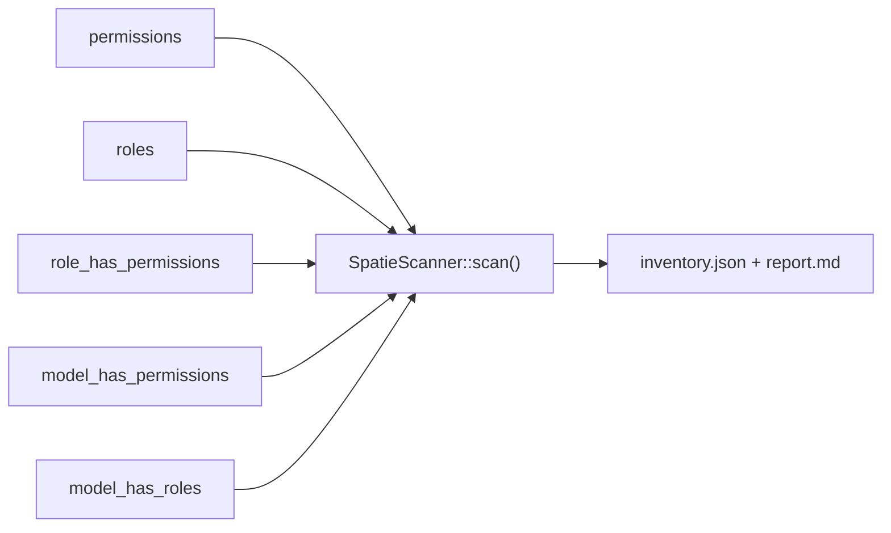

# Inventory & scan

The first migration step is to **see what you have**. `iam:spatie:scan` reads your live
`spatie/laravel-permission` tables and writes a structured inventory plus a review report. It is strictly
**read-only** — it never mutates a Spatie table.

## Motivation

You cannot map what you have not inventoried. Spatie schemas drift over time: empty roles, orphan
permissions, direct user grants that bypass roles, multiple guards. Each of those is a *smell* that will
distort the generated manifest if you carry it over blindly. The scan surfaces them first.

## Run it

```bash
php artisan iam:spatie:scan --output=storage/app/iam/spatie-inventory
```

| Option | Default | Purpose |
|---|---|---|
| `--output` | `storage/app/iam/spatie-inventory` | Output directory (created if missing) |

The command resolves the Spatie table names from `permission.table_names`, so a customized Spatie schema is
honored automatically.

## What it reads



`SpatieScanner::scan()` returns a map with these keys:

| Key | Contents |
|---|---|
| `permissions` | `[{ name, guard }]` for every permission row |
| `roles` | `[{ name, guard, permissions[] }]` — each role with its resolved permission names |
| `direct_user_permissions` | `[{ permission, model_type, model_id }]` from `model_has_permissions` |
| `model_has_roles_count` | count of role assignments to models |
| `guards` | the distinct guard names seen across roles and permissions |

## `inventory.json`

The full structured scan, pretty-printed. This is the input to
[manifest generation](/guides/manifest-generation). Example shape:

```json
{
  "permissions": [
    { "name": "orders.refund", "guard": "web" },
    { "name": "Manage Users", "guard": "web" }
  ],
  "roles": [
    { "name": "admin", "guard": "web", "permissions": ["orders.refund", "Manage Users"] },
    { "name": "viewer", "guard": "web", "permissions": [] }
  ],
  "direct_user_permissions": [
    { "permission": "orders.refund", "model_type": "App\\Models\\User", "model_id": "42" }
  ],
  "model_has_roles_count": 128,
  "guards": ["web"]
}
```

## `report.md`

A human-readable summary you review before mapping. It counts the smells:

```text
# Spatie → IAM — Report di inventory

- Ruoli: 12
- Permessi: 87
- Ruoli senza permessi: 2
- Permessi diretti utente: 5
- Guard distinti: 1

Rivedere a mano: naming incoerente, permessi duplicati semanticamente, permessi critical.
```

When more than one guard is present, the report flags `⚠️ guard multipli` — a strong signal you should
decide how guards map to IAM applications before proceeding.

## Worked example: acting on the smells

1. **Empty roles** (`Ruoli senza permessi`) — decide whether to drop them or keep them as placeholders.
   They will appear in the manifest with an empty `permissions[]`.
2. **Direct user permissions** — Spatie lets you grant a permission to a user without a role. IAM models
   access through roles/grants; plan how each direct grant becomes an IAM grant.
3. **Multiple guards** — each guard is effectively a different authorization surface. Map each to its own
   IAM application (`--app`) and run the migration per application.
4. **Inconsistent naming / semantic duplicates** — `"orders.refund"` and `"Orders Refund"` slug to the
   same key and will be deduplicated by the generator (see [permission slugging](/concepts/permission-slugging)).

::: collapsible "ADR — why the scanner is strictly read-only"
**Problem.** A migration tool that writes to the source system can corrupt the very data you are migrating,
and makes the operation irreversible mid-flight.

**Decision.** `SpatieScanner` issues only `SELECT`s. It never inserts, updates, or deletes a Spatie row. The
inventory is materialized into files under the output directory, never back into the database.

**Consequences.** The scan is safe to run on production, repeatedly, at any time. The cost is that any
cleanup (dropping empty roles, consolidating duplicates) is done by you, deliberately, in Spatie — the
bridge will not "fix" your schema behind your back.
:::

::: callout warning "Gotchas"
- The scan reflects the **live** tables at the moment it runs. Re-run it after you clean up smells so the
  manifest is generated from the corrected state.
- Direct user permissions are inventoried but are **not** turned into manifest roles — they need an explicit
  decision. Review `direct_user_permissions` before cutover.
- Empty role/permission names (blank rows) are filtered out of the role's permission list.
:::

## Next

- [Manifest generation](/guides/manifest-generation) — turn the inventory into a `laravel-iam.manifest.v2`.
- [Permission slugging](/concepts/permission-slugging) — exactly how names become keys.
