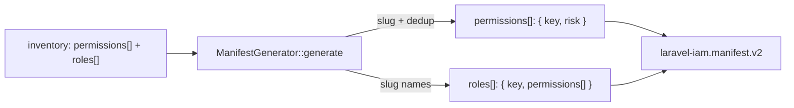

# Manifest generation

`iam:spatie:manifest` turns the [inventory](/guides/inventory-and-scan) into a
`laravel-iam.manifest.v2` — the declarative document the IAM server validates and registers. The manifest is
a **proposal**: every mapping and `risk` level is a heuristic for you to review, not a fact.

## Motivation

The IAM server is manifest-driven: applications declare their permissions and roles in a versioned manifest
that is validated against a schema before it is applied. Generating that manifest from your real Spatie
inventory means the proposal starts from ground truth, not a blank page.

## Run it

```bash
php artisan iam:spatie:manifest --app=billing --name="Billing" \
  --output=storage/app/iam/iam.manifest.json
```

| Option | Default | Purpose |
|---|---|---|
| `--app` | `legacy` | `app.key` of the manifest (the application identifier) |
| `--name` | = `--app` | `app.name` (human label) |
| `--output` | `storage/app/iam/iam.manifest.json` | Output file |

Internally the command runs a fresh `SpatieScanner::scan()` and feeds it to
`ManifestGenerator::generate($scan, ['key' => $app, 'name' => $name])`.

## The mapping



- Each Spatie permission name is slugged with `PermissionMapper::toKey()` to a valid IAM key
  (`^[a-z][a-z0-9_.-]*$`). Two names that slug to the **same** key are a semantic duplicate — the generator
  keeps the **first** and drops the rest.
- Each permission gets a starting `risk` from `PermissionMapper::inferRisk()`: `high` if the last
  `.`-segment is a high-impact action (`refund`, `delete`, `destroy`, `drop`, `truncate`, `grant`, `revoke`,
  `impersonate`, `export`, `approve`, `disable`, `suspend`, `wipe`), otherwise `low`.
- Each Spatie role becomes a manifest role; its `permissions[]` are the slugged keys, but **only** those that
  survived as real permissions (a role pointing at a deduplicated/blank permission references the surviving
  key, never a phantom one).

## The output

```json
{
  "schema": "laravel-iam.manifest.v2",
  "app": {
    "key": "billing",
    "name": "Billing",
    "type": "laravel",
    "risk_level": "low"
  },
  "permissions": [
    { "key": "orders.refund", "risk": "high" },
    { "key": "manage_users", "risk": "low" }
  ],
  "roles": [
    { "key": "admin", "permissions": ["orders.refund", "manage_users"] },
    { "key": "viewer", "permissions": [] }
  ]
}
```

See the [manifest schema reference](/reference/manifest-schema) for the full field contract.

## Validate & register

The manifest is a proposal — review it, then validate and register it on the server (these commands are
provided by `laravel-iam-server`):

```bash
php artisan iam:manifest:validate storage/app/iam/iam.manifest.json
php artisan iam:app:register      storage/app/iam/iam.manifest.json
```

The `manifest` command prints the next step for you:

```text
Manifest generato (2 permessi, 2 ruoli) → storage/app/iam/iam.manifest.json
Prossimo: php artisan iam:manifest:validate storage/app/iam/iam.manifest.json
```

::: collapsible "ADR — the manifest is a proposal, not a verdict"
**Problem.** Automatic risk inference and name slugging are heuristics. Treating them as authoritative would
ship wrong risk levels and silently merge permissions that *look* alike but mean different things.

**Decision.** The generator emits a manifest that is explicitly a **proposal**. `risk` is a starting
heuristic; deduplication keeps the first colliding key and surfaces the collision as a smell. Nothing is
applied until `iam:manifest:validate` passes and a human approves.

**Consequences.** You get a strong first draft for free, but you own the review. The validator on the server
is the gate that prevents an invalid or unreviewed manifest from changing live authorization.
:::

::: callout warning "Gotchas"
- **Deduplication is silent in the file** — only the inventory `report.md` hints at collisions. Review names
  that slug identically (`"orders.refund"` vs `"Orders Refund"`).
- **Risk inference only looks at the last `.`-segment.** `users.export` → `high` (export), but a custom
  action the heuristic doesn't know stays `low`. Re-rate critical permissions by hand.
- **Empty roles carry over** with an empty `permissions[]`. Decide whether to keep or drop them before
  registering.
- The `app.type` defaults to `laravel` and `app.risk_level` to `low`; adjust on the server side if needed.
:::

## Next

- [Permission slugging](/concepts/permission-slugging) — the slugging algorithm in detail.
- [Shadow mode](/guides/shadow-mode) — register the manifest and start observing.
- [Manifest schema](/reference/manifest-schema) — the full field contract.
