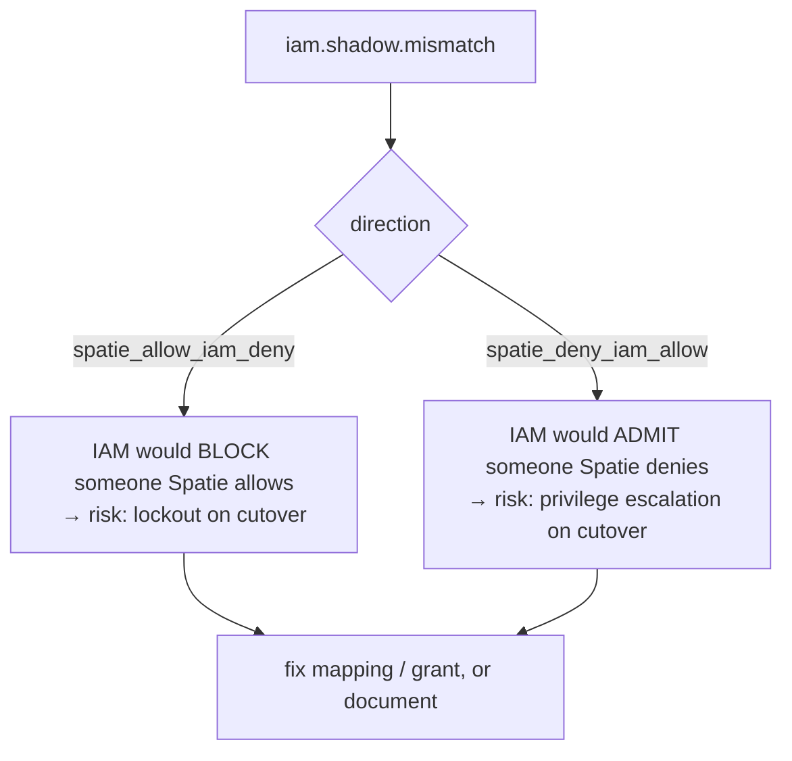

# Reviewing mismatches

Shadow mode produces one artifact: a stream of `iam.shadow.mismatch` records. Cutover readiness is defined by
that stream being **clean** — zero divergences, or every divergence explained. This page is how you get
there.

## Motivation

A mismatch is not a failure; it is information. Each one is either a **mapping bug** you fix in the manifest,
or an **intended change** in authorization you accept and document. The review loop converts a noisy log into
a decision you can defend to stakeholders.

## The record shape

Every divergence logs the same structured payload (from `MismatchRecorder::record()`):

| Field | Meaning |
|---|---|
| `subject_id` | IAM subject id of the user (`IamClient::resolveSubjectId($user)`) |
| `ability` | the **original** Spatie ability string checked |
| `spatie_allows` | Spatie's decision (the current authority) |
| `iam_allows` | IAM's parallel decision |
| `direction` | `spatie_allow_iam_deny` or `spatie_deny_iam_allow` |

## The two directions



- **`spatie_allow_iam_deny`** — on cutover this user would **lose** access they have today. Usually a missing
  permission or role in the manifest, or a missing grant on the IAM side.
- **`spatie_deny_iam_allow`** — on cutover this user would **gain** access they do not have today. Treat this
  as the higher-severity direction: it is a potential privilege escalation. Verify the IAM role/grant is
  intentional.

## The review loop

::: steps
1. **Aggregate by `ability` and `direction`.**
   Group the raw log so you see patterns, not individual lines. A whole permission diverging one direction is
   usually a single mapping bug, not many incidents.

2. **Classify each group.**
   - *Mapping bug* → fix the source: correct the slug/role in the inventory, re-run
     `iam:spatie:manifest`, re-validate and re-register.
   - *Intended change* → write it down (changelog/ticket) with the reason. It is an accepted divergence.

3. **Re-register and let shadow re-observe.**
   After fixing the manifest on the server, the same traffic should stop producing that mismatch. Confirm the
   group disappears from the log.

4. **Repeat until clean.**
   "Clean" = zero unexplained mismatches over a representative window of real traffic.
:::

## Worked example

You see a recurring group:

```text
iam.shadow.mismatch  { ability: "reports.export", spatie_allows: true, iam_allows: false,
                       direction: "spatie_allow_iam_deny", subject_id: "user_77", ... }
```

Diagnosis: the `analyst` role in Spatie has `reports.export`, but the generated manifest's `analyst` role is
missing the slugged key `reports.export` (perhaps it was a direct user grant in Spatie, not a role
permission). Fix: add the permission to the role in the manifest source, re-run `iam:spatie:manifest`,
`iam:manifest:validate`, `iam:app:register`. The group disappears on the next observation window.

::: collapsible "ADR — review-to-clean as the cutover gate"
**Problem.** Without an explicit, evidence-based gate, teams cut over on a hunch and discover lockouts or
escalations in production.

**Decision.** The cutover gate is a **clean mismatch log over real traffic**: zero divergences or every
divergence explained and accepted. The artifact is auditable — you can show stakeholders the empty (or fully
annotated) diff.

**Consequences.** Cutover becomes a defensible decision backed by data, not a leap. The cost is patience: you
must run shadow long enough to cover representative traffic (e.g. a full business cycle).
:::

::: callout warning "Gotchas"
- **Sampling bias.** A clean log over a quiet weekend is not evidence. Run shadow across a representative
  window — month-end jobs, admin flows, edge roles.
- **`spatie_deny_iam_allow` is the dangerous direction.** Never wave it through as "IAM is just more
  generous" — confirm the extra access is intended.
- **The `ability` is the original Spatie string**, not the IAM `full_key`. Map it back through
  [permission slugging](/concepts/permission-slugging) when correlating with the manifest.
:::

## Next

- [Cutover & rollback](/guides/cutover-and-rollback) — flip to enforce once the diff is clean.
- [Observability & mismatch logs](/operations/observability) — route and aggregate the stream.
