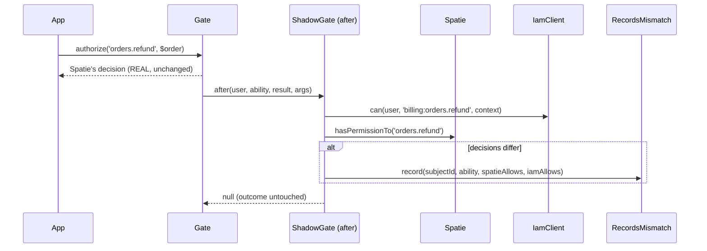

# Shadow mode

Shadow mode is the heart of the bridge: Spatie keeps deciding **for real**, IAM decides **in parallel**, and
the bridge records only the decisions where they disagree. No user is ever blocked or let in by IAM during
this phase.

## Motivation

Before you trust a new authorization authority you need evidence that it agrees with the old one on *your*
traffic — not on a synthetic test set. Shadow mode gives you that evidence by mirroring every real `Gate`
check to IAM and logging the divergences, while changing nothing that users experience.

## How it engages

When `IAM_SPATIE_MODE=shadow` (the default), `IamSpatieBridgeServiceProvider::packageBooted()` registers the
`ShadowGate` on the application `Gate`. `ShadowGate::register()` installs a single `Gate::after` callback:

```php
$gate->after(function (Authenticatable $user, string $ability, ?bool $result, array $arguments = []): ?bool {
    $this->compare($user, $ability, $result, $arguments);

    return null; // shadow: never change the local outcome
});
```

Returning `null` from `Gate::after` is what makes shadow non-intrusive: the local decision (Spatie's) stands.

## The comparison



`ShadowGate::compare()` does four things:

1. **Resolve the IAM ability.** If the Spatie ability already contains `:` it is used as-is; otherwise it
   becomes `"<application>:<key>"`, where `application` is `IAM_SPATIE_APP` and `key` comes from
   `PermissionMapper::toKey()`.
2. **Build context.** `{ application }`, plus `resource` if the first `Gate` argument is a non-empty string.
3. **Ask IAM** via `IamClient::can($user, $iamAbility, $context)`.
4. **Ask Spatie directly** via the `hasPermissionTo` probe, then compare.

## The direct Spatie probe

```php
private function spatieAllows(Authenticatable $user, string $ability, ?bool $gateResult): bool
{
    $probe = [$user, 'hasPermissionTo'];
    if (is_callable($probe)) {
        try {
            return (bool) $probe($ability);
        } catch (\Throwable) {
            return false; // permission unknown to Spatie → deny
        }
    }

    return $gateResult === true; // no Spatie trait → fall back to the Gate result
}
```

The bridge interrogates Spatie **directly** rather than trusting the `?bool $result` handed to
`Gate::after`. That result may have been short-circuited by another `Gate::before` (for example the IAM
client's own enforcement), which would make you compare IAM with IAM. See
[decision diffing & deny-overrides](/concepts/decision-diffing) for the full reasoning.

::: callout info "Fail-closed probe"
If `hasPermissionTo` throws (a permission Spatie has never heard of), the probe returns `false` — deny. A
permission unknown to Spatie can never read as an accidental allow.
:::

## What gets logged

Only on divergence (`$iamAllows !== $spatieAllows`), `RecordsMismatch::record()` is called. The default
`MismatchRecorder` writes a structured warning:

```text
iam.shadow.mismatch
{
  "subject_id": "user_42",
  "ability": "orders.refund",
  "spatie_allows": true,
  "iam_allows": false,
  "direction": "spatie_allow_iam_deny"
}
```

`direction` is `spatie_allow_iam_deny` when Spatie allowed and IAM denied, otherwise
`spatie_deny_iam_allow`. Point the channel with `IAM_SPATIE_MISMATCH_CHANNEL`; swap the binding to send
mismatches to a dashboard or review queue (see [observability](/operations/observability)).

## Worked example

```php
// Application code — unchanged.
Gate::authorize('orders.refund', $order);
```

With `IAM_SPATIE_APP=billing`, the bridge evaluates `billing:orders.refund` on IAM with context
`{ application: "billing", resource: <first arg if string> }`, probes Spatie's `hasPermissionTo('orders.refund')`,
and logs `iam.shadow.mismatch` only if the two disagree. The user's request proceeds on Spatie's decision
either way.

::: collapsible "ADR — why Gate::after and not a Gate::before"
**Problem.** To observe parity you must see Spatie's real decision. A `Gate::before` runs *before* the
policy and would have to reimplement Spatie's logic; it can also short-circuit the gate.

**Decision.** Use `Gate::after`, which fires once the real evaluation is done, and return `null` to leave the
outcome untouched. Pair it with a direct `hasPermissionTo` probe so the comparison never depends on a
possibly short-circuited gate result.

**Consequences.** Observation is faithful and non-intrusive. The trade-off is that the comparison logic lives
in `compare()`/`spatieAllows()` rather than relying on the framework's gate result — which is exactly what
prevents false-zero diffs.
:::

::: callout warning "Gotchas"
- Shadow adds an IAM call per `Gate` check. Keep the IAM client's policy cache warm; see
  [troubleshooting](/operations/troubleshooting) for latency notes.
- The `resource` context is only attached when the first `Gate` argument is a **non-empty string**. Object
  arguments are not auto-serialized into context.
- If your user model lacks Spatie's `HasRoles` / `HasPermissions` traits (so `hasPermissionTo` is not
  callable), the probe falls back to the possibly short-circuited gate result — keep the trait on the model
  you migrate.
:::

## Next

- [Reviewing mismatches](/guides/reviewing-mismatches) — turn the log into a clean diff.
- [Decision diffing & deny-overrides](/concepts/decision-diffing) — the comparison semantics.
- [ShadowGate internals](/architecture/shadow-gate) — the class, line by line.
