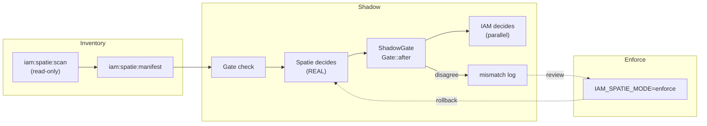

# laravel-iam-bridge-spatie-permission

`padosoft/laravel-iam-bridge-spatie-permission` is the **migration path** off
[`spatie/laravel-permission`](https://spatie.be/docs/laravel-permission) onto
[Laravel IAM](https://doc.laravel-iam-server.padosoft.com) — an Identity & Authorization control plane.

It treats migration as an **observation problem before it is a switch**: you scan your existing roles and
permissions (read-only), turn them into an IAM manifest, run **both** authorities side by side, record only
the decisions where they disagree, and cut over only once that diff is clean — with a rollback that is a
single environment variable away.

::: callout tip "Migrate on evidence, not hope"
You never flip authorization blindly. During the **shadow** phase Spatie keeps deciding for real and IAM
decides *in parallel*; the bridge logs only the mismatches. Nobody is ever blocked or let in by IAM until you
explicitly switch to `enforce`.
:::

## The three phases

1. **Inventory** — `iam:spatie:scan` reads your Spatie roles/permissions (touches nothing) and
   `iam:spatie:manifest` turns them into a `laravel-iam.manifest.v2`.
2. **Shadow** — Spatie keeps deciding; `ShadowGate` evaluates IAM in parallel on every `Gate` check and logs
   the divergences as `iam.shadow.mismatch`.
3. **Enforce** — once the mismatch log is clean (or every entry is explained), flip
   `IAM_SPATIE_MODE=enforce`. IAM becomes the authority; Spatie stays a read-only cache. Rollback = flip it
   back.

## Why this exists

`spatie/laravel-permission` is an excellent in-app RBAC library — until you outgrow it. Multiple apps, a real
audit trail, ABAC/ReBAC conditions, governance and access reviews, an OAuth/OIDC provider: that is a
**control plane**, and that is Laravel IAM. But you cannot just flip authorization for a live application and
hope. One wrong mapping locks people out of production — or, worse, lets them in. This bridge makes the move
**boring and reversible**.

::: grids
::: grid
::: card "Quickstart" icon:rocket
Install, scan, and see your first inventory in five minutes.

[Open →](/quickstart)
:::
::: card "Core concepts" icon:brain
Inventory, manifest, shadow diffing, deny-overrides, reversible cutover.

[Open →](/core-concepts)
:::
::: card "Migration pipeline" icon:workflow
The architecture: scan → manifest → shadow → cutover → rollback.

[Open →](/architecture/migration-pipeline)
:::
:::
:::

## Ecosystem

This package is one piece of **Laravel IAM**. The other consumable packages:

| Package | Role |
| --- | --- |
| [laravel-iam-contracts](https://doc.laravel-iam-contracts.padosoft.com) | Shared contracts/interfaces + DTOs (PDP, KeyProvider, Assurance, FeatureScope) — the dependency root |
| [laravel-iam-server](https://doc.laravel-iam-server.padosoft.com) | The IAM server: identity, org, Application Registry + manifest, PDP (RBAC+ABAC+ReBAC), OAuth/OIDC, tamper-evident audit, IGA, Admin API + panel |
| [laravel-iam-client](https://doc.laravel-iam-client.padosoft.com) | Laravel client for consumer apps: OIDC login, JWT/JWKS verification, introspection, `iam.auth`/`iam.can` middleware, Gate adapter, policy cache, webhook receiver |
| **laravel-iam-bridge-spatie-permission** *(this repo)* | Migration bridge off `spatie/laravel-permission` (scan, manifest, shadow mode, cutover, rollback) |
| [laravel-iam-ai](https://doc.laravel-iam-ai.padosoft.com) | Optional AI module, advisory-only (redaction + hallucination-guard + audit) on a sovereign transport |
| [laravel-iam-directory](https://doc.laravel-iam-directory.padosoft.com) | Optional Directory module: LDAP / Active Directory (LdapRecord) |
| [laravel-iam-node](https://www.npmjs.com/package/@padosoft/laravel-iam-node) | Node/TS client SDK — thin + fail-closed |
| [laravel-iam-react-native](https://www.npmjs.com/package/@padosoft/laravel-iam-react-native) | React Native client SDK — thin + hooks |
| [laravel-iam-rust](https://crates.io/crates/laravel-iam) | Rust client SDK — async + blocking, fail-closed |

## Where to next

- [Quickstart](/quickstart) — install and run your first scan.
- [Core concepts](/core-concepts) — the mental model.
- [Migration runbook → Cutover & rollback](/guides/cutover-and-rollback) — the full reversible flow.
- [Reference → CLI](/reference/cli) — every command and option.
