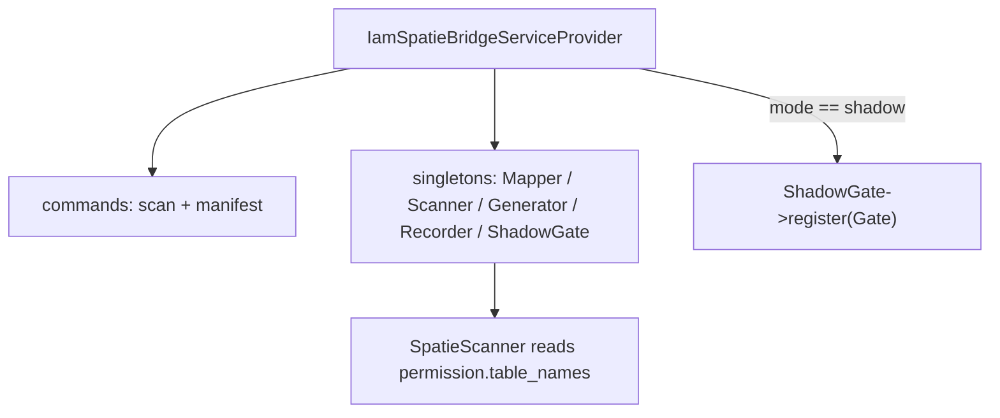

# Installation

## Requirements

| Requirement | Version / note |
|---|---|
| PHP | **8.3+** (`"php": "^8.3"`) |
| Laravel | **13+** |
| `spatie/laravel-permission` | **v6** (`"^6.0"`) — an existing install with roles/permissions |
| Laravel IAM server | reachable, via [`padosoft/laravel-iam-client`](https://doc.laravel-iam-client.padosoft.com) |
| `padosoft/laravel-iam-contracts` | `^1.0` (shared DTOs/contracts) |

The bridge declares `spatie/laravel-permission`, `padosoft/laravel-iam-server`,
`padosoft/laravel-iam-client` and `padosoft/laravel-iam-contracts` as runtime dependencies in its
`composer.json`.

## Install

```bash
composer require padosoft/laravel-iam-bridge-spatie-permission
```

The service provider `Padosoft\Iam\Bridge\Spatie\IamSpatieBridgeServiceProvider` is **auto-discovered**
(registered in `composer.json` under `extra.laravel.providers`). No manual registration is needed.

## Publish the config

```bash
php artisan vendor:publish --tag=iam-spatie-config
```

This writes `config/iam-spatie.php`. See the [Configuration reference](/operations/configuration) for every
key; the defaults are deliberately safe:

```php
return [
    'mode' => env('IAM_SPATIE_MODE', 'shadow'),   // shadow | enforce
    'application' => env('IAM_SPATIE_APP', 'app'), // prefix for namespace-less permissions
    'cache' => [
        'write_protection' => true,
        'sync_on_webhook' => true,
        'sync_on_login' => true,
    ],
    'mismatch_log_channel' => env('IAM_SPATIE_MISMATCH_CHANNEL'),
];
```

::: callout info "Shadow by default — installing changes nothing"
`IAM_SPATIE_MODE` defaults to `shadow`. In shadow the `ShadowGate` only **observes**: it hooks
`Gate::after`, compares IAM vs Spatie, and returns `null` so the live outcome is never changed. Spatie
remains the sole authority until you deliberately switch to `enforce`.
:::

## What the service provider wires

On boot, `IamSpatieBridgeServiceProvider`:

- registers the two artisan commands `iam:spatie:scan` and `iam:spatie:manifest`;
- binds `PermissionMapper`, `SpatieScanner`, `ManifestGenerator`, `RecordsMismatch`/`MismatchRecorder` and
  `ShadowGate` as singletons;
- reads the **Spatie table names** from `permission.table_names` so a customized Spatie schema is honored
  by the scanner;
- **only in `mode=shadow`**, registers the `ShadowGate` on the application `Gate`.



## Verify

```bash
php artisan list iam:spatie
# iam:spatie:scan        Inventory (read-only) di spatie/laravel-permission ...
# iam:spatie:manifest    Genera un manifest IAM dall'inventory ...
```

## Next

- [Quickstart](/quickstart) — run the full loop.
- [Configuration](/operations/configuration) — every config key and env var.
