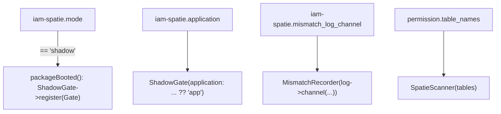

# Configuration

All configuration lives in `config/iam-spatie.php`, published with
`php artisan vendor:publish --tag=iam-spatie-config`. The defaults are deliberately safe: installing the
bridge changes no authorization behavior.

## The full file

```php
return [
    // 'shadow' = Spatie decides for real, IAM in parallel (diffing, no blocking).
    // 'enforce' = IAM is the authority.
    'mode' => env('IAM_SPATIE_MODE', 'shadow'),

    // Maps a Spatie permission ("orders.refund") to the IAM full_key ("billing:orders.refund").
    // 'application' is the prefix applied to permissions without a namespace.
    'application' => env('IAM_SPATIE_APP', 'app'),

    // Spatie as a read-only cache after cutover: block/audit local writes.
    'cache' => [
        'write_protection' => true,
        'sync_on_webhook' => true,
        'sync_on_login' => true,
    ],

    // Log channel for shadow mismatches (divergent allow/deny between Spatie and IAM).
    'mismatch_log_channel' => env('IAM_SPATIE_MISMATCH_CHANNEL'),
];
```

## Key reference

| Key | Env | Default | Meaning |
|---|---|---|---|
| `mode` | `IAM_SPATIE_MODE` | `shadow` | `shadow` (observe; `ShadowGate` registered) or `enforce` (IAM is authority; observer **not** registered) |
| `application` | `IAM_SPATIE_APP` | `app` | Prefix for namespace-less permissions → `full_key` `<app>:<key>` |
| `cache.write_protection` | — | `true` | After cutover, block/audit writes to the now read-only Spatie tables |
| `cache.sync_on_webhook` | — | `true` | Re-sync the local Spatie cache when IAM sends a webhook |
| `cache.sync_on_login` | — | `true` | Re-sync the local Spatie cache on user login |
| `mismatch_log_channel` | `IAM_SPATIE_MISMATCH_CHANNEL` | `null` | Laravel log channel for `iam.shadow.mismatch` records |

## How the provider reads it

`IamSpatieBridgeServiceProvider` consumes these keys via a small `stringConfig()` helper (which treats blank
strings as `null`):



- **`mode`** — `packageBooted()` registers the `ShadowGate` **only** when `mode === 'shadow'`. Any other
  value (including `enforce`) means the observer is not attached.
- **`application`** — passed to `ShadowGate`; falls back to `'app'` if blank. This is the prefix in
  `full_key` resolution.
- **`mismatch_log_channel`** — passed to `Log::channel(...)` for the default `MismatchRecorder`. `null` uses
  the default channel.
- **`permission.table_names`** — *not* in this file; it is Spatie's own config, read so the scanner honors a
  customized Spatie schema.

## Typical `.env` per phase

::: tabs
== tab "Shadow (default)"
```dotenv
IAM_SPATIE_MODE=shadow
IAM_SPATIE_APP=billing
IAM_SPATIE_MISMATCH_CHANNEL=iam-shadow
```
== tab "Enforce (after clean diff)"
```dotenv
IAM_SPATIE_MODE=enforce
IAM_SPATIE_APP=billing
```
== tab "Rollback"
```dotenv
IAM_SPATIE_MODE=shadow
```
:::

::: callout warning "Clear config cache after changing mode"
If you run `php artisan config:cache`, a change to `IAM_SPATIE_MODE` will not take effect until you
`php artisan config:clear` (or re-cache). The mode is read at boot.
:::

## Next

- [Observability & mismatch logs](/operations/observability) — the `iam-shadow` channel and custom sinks.
- [Cutover & rollback](/guides/cutover-and-rollback) — what each `mode` does.
