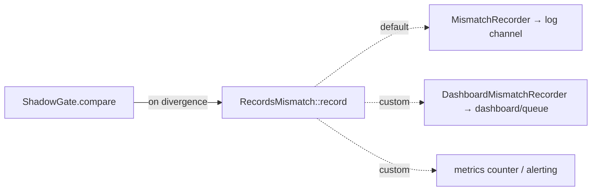

# Observability & mismatch logs

Shadow mode's only output is the `iam.shadow.mismatch` stream. Making that stream visible, routable, and
aggregatable is what turns shadow from "running" into "useful".

## The record

The default `MismatchRecorder` emits a structured **warning** for every divergence:

```php
$this->logger->warning('iam.shadow.mismatch', [
    'subject_id' => $subjectId,
    'ability' => $ability,
    'spatie_allows' => $spatieAllows,
    'iam_allows' => $iamAllows,
    'direction' => $spatieAllows ? 'spatie_allow_iam_deny' : 'spatie_deny_iam_allow',
]);
```

| Field | Use |
|---|---|
| `subject_id` | correlate to a user across systems (IAM subject id) |
| `ability` | the original Spatie ability string |
| `spatie_allows` / `iam_allows` | the two decisions |
| `direction` | aggregate severity: `spatie_allow_iam_deny` (lockout) vs `spatie_deny_iam_allow` (escalation) |

It is logged at `warning` level and **never throws** — recording a mismatch cannot break a request.

## Route the channel

Set the channel with `IAM_SPATIE_MISMATCH_CHANNEL` and define it in `config/logging.php`. A dedicated channel
keeps the diff out of your general logs and makes it easy to query:

```php
// config/logging.php
'channels' => [
    'iam-shadow' => [
        'driver' => 'daily',
        'path' => storage_path('logs/iam-shadow.log'),
        'level' => 'warning',
        'days' => 30,
    ],
],
```

```dotenv
IAM_SPATIE_MISMATCH_CHANNEL=iam-shadow
```

A `null` channel (the default) uses the application's default log channel.

## Swap the sink

`MismatchRecorder` is just the default implementation of the `RecordsMismatch` interface:

```php
interface RecordsMismatch
{
    public function record(string $subjectId, string $ability, bool $spatieAllows, bool $iamAllows): void;
}
```

Bind your own implementation to push divergences to a dashboard, a metrics counter, or a review queue —
without touching `ShadowGate`:

```php
// A custom sink that also increments a metric and queues for review.
final class DashboardMismatchRecorder implements RecordsMismatch
{
    public function __construct(private readonly Dashboard $dashboard) {}

    public function record(string $subjectId, string $ability, bool $spatieAllows, bool $iamAllows): void
    {
        $this->dashboard->pushMismatch([
            'subject_id' => $subjectId,
            'ability' => $ability,
            'spatie_allows' => $spatieAllows,
            'iam_allows' => $iamAllows,
            'direction' => $spatieAllows ? 'spatie_allow_iam_deny' : 'spatie_deny_iam_allow',
        ]);
    }
}
```

```php
// In a service provider:
$this->app->bind(RecordsMismatch::class, DashboardMismatchRecorder::class);
```



::: callout tip "Aggregate by ability + direction"
Whatever sink you use, aggregate the stream by `ability` and `direction` rather than reading lines. A whole
permission diverging one way is one mapping bug, not a hundred incidents — see
[reviewing mismatches](/guides/reviewing-mismatches).
:::

## What "clean" looks like

A migration is ready to cut over when, over a representative window, the channel shows **zero** unexplained
mismatches. Archive that evidence — it is the audit artifact behind the cutover decision.

::: callout warning "Gotchas"
- The recorder is bound as a singleton; bind your custom implementation **before** the container resolves
  `ShadowGate` (a service provider `register()` is the right place).
- `record()` must not throw — a sink that can fail should swallow/queue internally, or it could affect the
  request path it is observing.
- The logged `ability` is the **original** Spatie string, not the IAM `full_key`; map it back via
  [slugging](/concepts/permission-slugging) when correlating with the manifest.
:::

## Next

- [Reviewing mismatches](/guides/reviewing-mismatches) — the human loop over this stream.
- [Troubleshooting](/operations/troubleshooting) — when the stream looks wrong.
